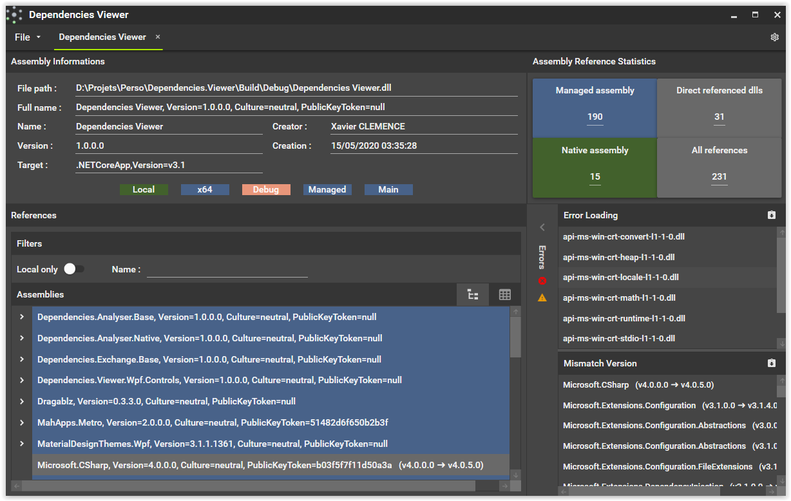
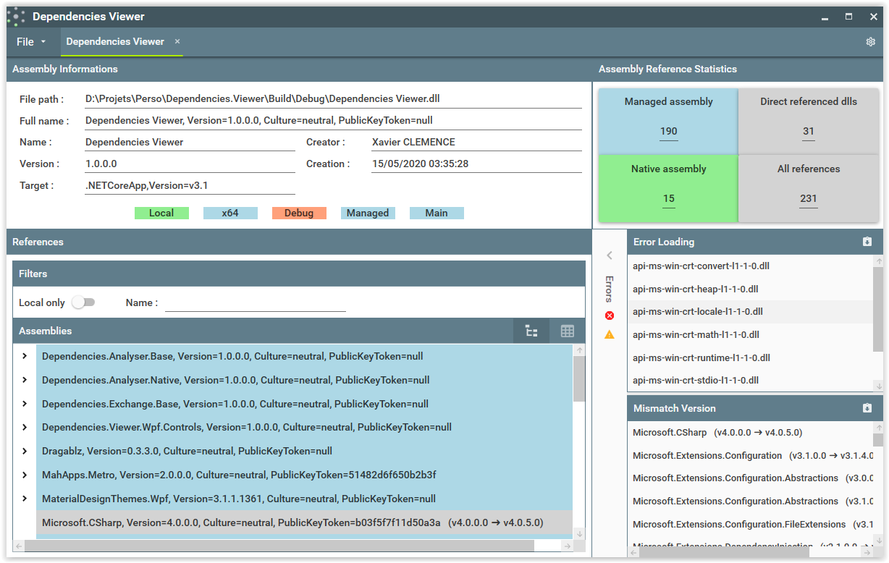

# Dependencies Viewer

[](https://opensource.org/licenses/MIT)
[![Ms Build][github-actions-badge]][github-actions]

Dependencies Viewer is a dependencies analyser for Microsoft assemblies. It's supports managed assemblies (.Net Framework and .Net Core), Native Assemblies (C++), and mix assemblies (managed and native links with dll import or cli/c++).

It allows you to find missing assemblies or mismatch versions between referenced assembly and loaded assembly (assembly redirect).

Dependencies Viewer required [**.Net Core 3.1 runtime**](https://dotnet.microsoft.com/download/dotnet-core/3.1)



# How to analyse assembly 
- File-> open File
- Drag and drop assembly on Dependencies Viewer main window
- Command Line 
```
"Dependencies Viewer.exe" c:\MyAssembly.dll
```


# Plugins

## Link project
|        Project                                        |                Build State                                | 
| ----------------------------------------------------- | --------------------------------------------------------- | 
| [**Dependencies Analyser**][analyser-url]             |      [![Build][analyser-badge]][analyser-url]             | 
| [**Dependencies Exchange**][exchange-url]             |      [![Build][exchange-badge]][exchange-url]             | 
| [**Dependencies Graph Services**][graph-service-url]  |      [![Build][graph-service-badge]][graph-service-url]   | 

## Analysers

Dependencies Viewer uses plugins to analyse an assembly. All plugins can be found in [*Depencies Analyser*][analyser-url] project. You can change analyser from the settings view

Now Dependencies Viewer support:
- Mono analyser
- Microsoft analyser

## Import export 

Dependencies viewer allows import-export analysis results. All code of these plugins are located in [*Depencies Exchange*][exchange-url] project.

Now Dependencies Viewer support:
- Json file
- Dependencies Graph Service

### Dependencies Graph Service

To use Dependencies Graph Services, you need to configure service URL from setting screen (Import/Export part)

## Themes
You can choose your favorite theme between dark and light.

  

Light theme is selected by default. But you change the theme from the settings view.

[github-actions]:                  https://github.com/xclemence/Dependencies.Viewer/actions
[github-actions-badge]:            https://github.com/xclemence/Dependencies.Viewer/workflows/Build/badge.svg?branch=master

[graph-service-url]:               https://github.com/xclemence/Dependencies-graph-services
[graph-service-badge]:             https://github.com/xclemence/Dependencies-graph-services/workflows/Build/badge.svg?branch=master

[analyser-badge]:                  https://github.com/xclemence/Dependencies.Viewer/workflows/Ms%20Build/badge.svg
[analyser-url]:                    https://github.com/xclemence/Dependencies.Viewer

[exchange-badge]:                   https://github.com/xclemence/Dependencies.Exchange/workflows/WPF%20.NET%20Core/badge.svg?branch=master
[exchange-url]:                     https://github.com/xclemence/Dependencies.Exchange
